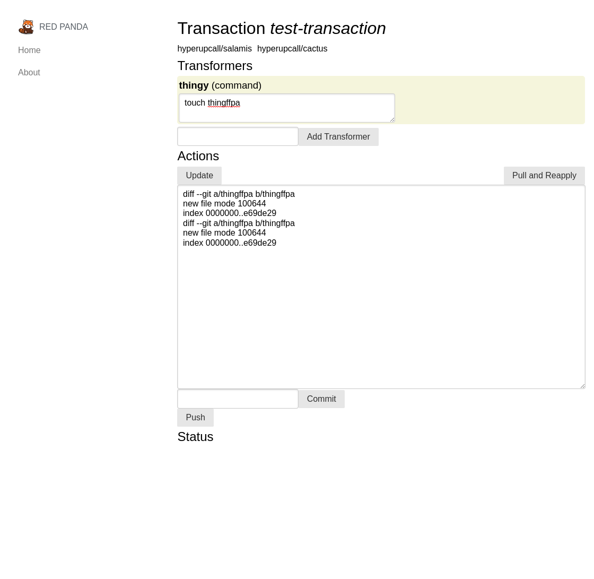

# redpanda

Cross-repository refactoring

STATUS: IN DEVELOPMENT

## Preview

As you can see, it is bare bones. It makes transactions like [this one](https://github.com/hyperupcall/salamis/commit/064b6f544e1fa3c6fd6a034ada83b22bc5ebc3ee)

## Concepts

- This tool helps make changes to multiple repositories at once. Such an event is called a **Transaction**
- Transactions have several **Modifiers** that modify the repository in some way
- **Actions**

## Modifiers

- String replacement
- Regex
- Language-specific AST parsers / transform plugin thingies
- [Comby](https://comby.dev)
